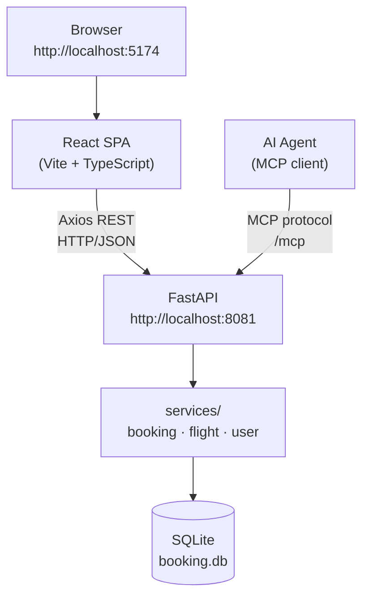
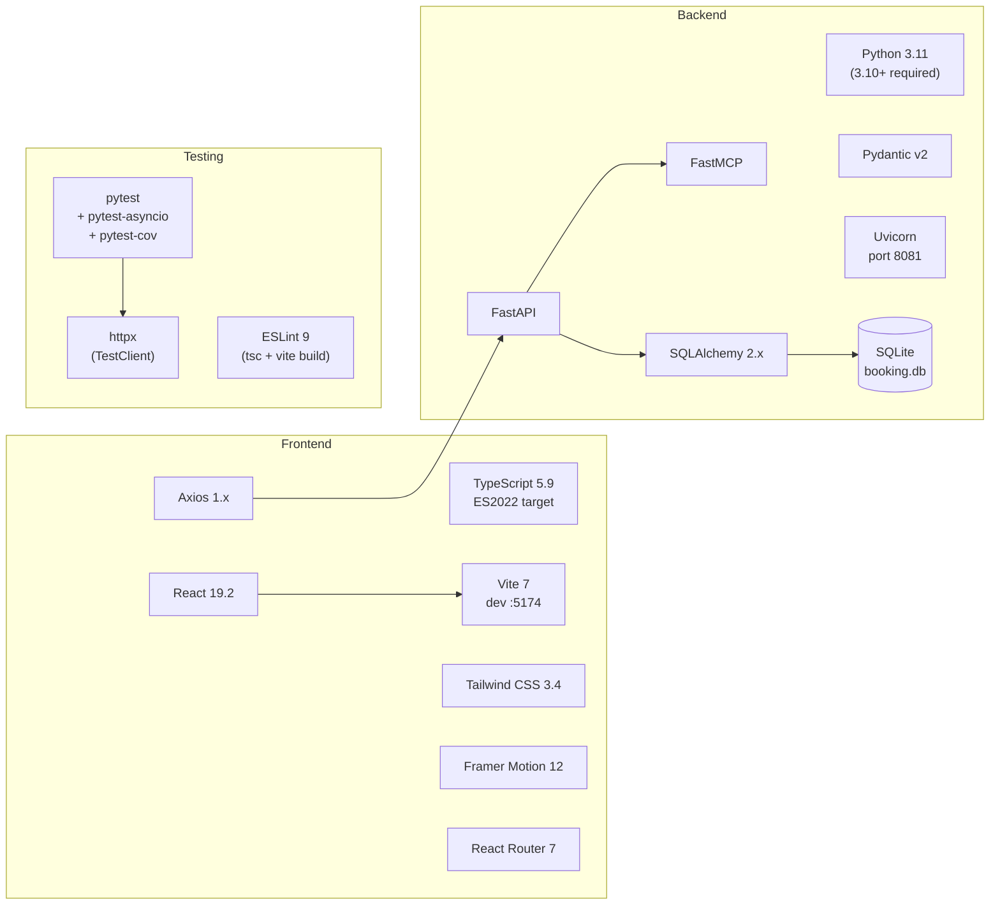
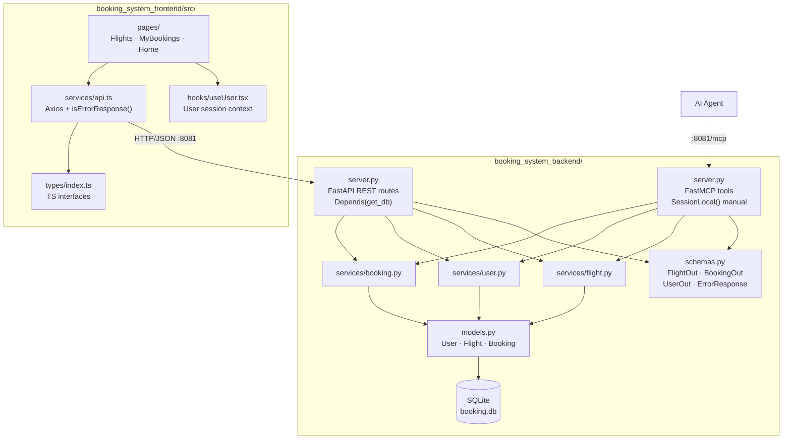
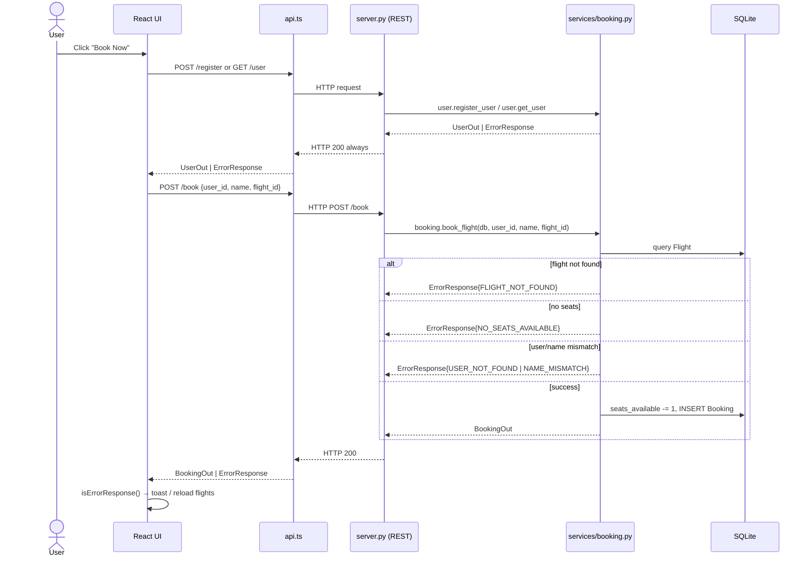
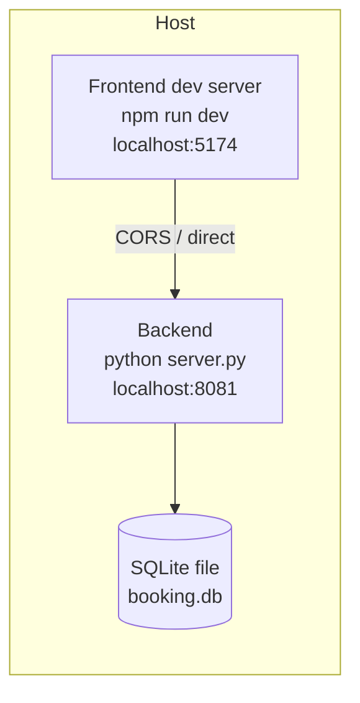

# Galaxium Travels — Onboarding Guide

> Concise technical reference for new contributors. Covers architecture, stack, components, testing, and deployment.

---

## Table of Contents

1. [Application Overview](#1-application-overview)
2. [Tech Stack Analysis](#2-tech-stack-analysis)
3. [Key Components & Interactions](#3-key-components--interactions)
4. [Unit Test Coverage](#4-unit-test-coverage)
5. [End-to-End Test Coverage](#5-end-to-end-test-coverage)
6. [Deployment Model](#6-deployment-model)

---

## 1. Application Overview

### Purpose

Galaxium Travels is a **demo full-stack interplanetary flight booking system**. Users browse solar-system routes, register with name/email, book seats, and cancel reservations. The backend exposes every operation over both a **REST API** and an **MCP (Model Context Protocol)** interface, making it usable by humans via the UI and by AI agents directly.

### Project Structure

```
galaxium-travels/
├── booking_system_backend/     # Python API server (FastAPI + FastMCP)
│   ├── server.py               # REST routes AND MCP tools — single file
│   ├── services/               # Business logic (flight, user, booking)
│   ├── models.py               # SQLAlchemy ORM models
│   ├── schemas.py              # Pydantic v2 request/response models
│   ├── db.py                   # SQLite session factory & init
│   ├── seed.py                 # Demo data seeded on every startup
│   ├── tests/                  # pytest suite
│   ├── Dockerfile
│   └── requirements.txt
│
├── booking_system_frontend/    # React 19 + TypeScript SPA (Vite)
│   ├── src/
│   │   ├── pages/              # Home · Flights · MyBookings
│   │   ├── components/         # common · flights · bookings · layout · user
│   │   ├── services/api.ts     # Single Axios instance
│   │   ├── types/index.ts      # TS interfaces mirroring backend schemas
│   │   ├── hooks/useUser.tsx   # User session context
│   │   └── utils/formatters.ts
│   └── ...config files
│
├── internal-monologue/         # Bob AI interaction log (one file per session)
├── .bob/                       # Bob AI config: rules + mode-specific AGENTS.md
├── docs/                       # Project documentation (this file)
├── AGENTS.md                   # AI agent guidance for this repo
├── start.bat / start.sh        # One-command launchers (Windows / Unix)
└── README.md
```

### High-Level Architecture



### Top-Level Directory Responsibilities

| Directory | Responsibility |
|---|---|
| `booking_system_backend/` | Entire server process: REST routes, MCP tools, business logic, ORM, DB, seeding, tests |
| `booking_system_frontend/` | React SPA: UI pages, component library, API client, TypeScript types |
| `.bob/` | Bob AI workspace config — project-wide rules and mode-specific coding instructions |
| `internal-monologue/` | Persistent log of Bob AI interactions; mandated by `.bob/rules/basic-rules.md` |
| `docs/` | Project documentation |

---

## 2. Tech Stack Analysis

### Stack at a Glance



### Backend

| Category | Detail |
|---|---|
| Language | Python — requires 3.10+ in practice (`X \| Y` union syntax used in services) |
| Runtime image | `python:3.11-slim` (Dockerfile) |
| Framework | FastAPI — OpenAPI/Swagger auto-generated at `/docs` |
| MCP layer | FastMCP — mounted into FastAPI at `/mcp` via `app.mount()` |
| ORM | SQLAlchemy 2.x — declarative `Base`; all time fields stored as `String` |
| Validation | Pydantic v2 — ORM hydration via `Model.model_validate()` (not `.from_orm()`) |
| Database | SQLite (`booking.db`) — file-based, no migrations (`create_all` on startup) |
| ASGI server | Uvicorn |
| Test framework | pytest + pytest-asyncio + pytest-cov; httpx for `TestClient` |
| Dependency file | `requirements.txt` — **no pinned versions**, installs are not reproducible without a lockfile |

### Frontend

| Category | Detail |
|---|---|
| Language | TypeScript 5.9 — strict mode, `noUnusedLocals`, `noUnusedParameters`, `erasableSyntaxOnly` |
| JS target | ES2022 |
| Runtime requirement | Node.js 18+ |
| Framework | React 19.2 |
| Build tool | Vite 7 — dev server port 5174, prod bundle to `dist/` |
| Routing | React Router DOM 7 |
| HTTP client | Axios 1.x — single configured instance in `src/services/api.ts` |
| Styling | Tailwind CSS 3.4 + PostCSS + Autoprefixer |
| Custom design tokens | `space-dark`, `space-blue`, `cosmic-purple`, `nebula-pink`, `alien-green`, `solar-orange`, `star-white` |
| Animation | Framer Motion 12 |
| Notifications | React Hot Toast 2 |
| Icons | Lucide React |
| Utilities | `clsx` (conditional classes), `date-fns` 4 |
| Linting | ESLint 9 flat config — `typescript-eslint` + `react-hooks` + `react-refresh` |
| Test framework | **None** — `npm run build` (tsc + Vite) is the only validation gate |

---

## 3. Key Components & Interactions

### Component Interaction Map



### Component Responsibilities

| Component | Responsibility |
|---|---|
| `server.py` (REST) | Thin route handlers — validate HTTP request shape, delegate to services, return result as-is |
| `server.py` (MCP) | Same logic as REST tools; raises `Exception` if service returns `ErrorResponse` |
| `services/booking.py` | Core business logic: seat availability check → user/name validation → seat decrement → booking insert |
| `services/user.py` | Register (unique email) and lookup (requires both name + email) |
| `services/flight.py` | List all flights — no filtering, no create/update/delete |
| `models.py` | ORM schema; no `relationship()` — joins done manually in services |
| `schemas.py` | Pydantic v2 in/out models; `ErrorResponse.success` is always `False` |
| `services/api.ts` | Axios instance; response interceptor normalises all errors to `ErrorResponse` shape |
| `types/index.ts` | TypeScript interfaces mirroring backend schemas 1:1 |
| `hooks/useUser.tsx` | React context — holds `user_id`, `name`, `email` in memory (no persistence) |

### Booking Lifecycle Data Flow



### Cross-Service Contracts

| Contract | Implication |
|---|---|
| **HTTP always 200** | Services return `ErrorResponse`, never raise. Callers must use `isErrorResponse()`. Breaking this breaks both the frontend interceptor and MCP error handling. |
| **`name` required for booking** | `book_flight` validates `user_id` + `name` together. Passing only `user_id` always errors. |
| **No `/api/` prefix** | Routes are `/flights`, `/book`, `/cancel/{id}` — not `/api/*` (backend README is wrong). |
| **Seat count is in-process** | No DB-level lock on `seats_available` — concurrent workers could double-book. |
| **Time fields are strings** | `booking_time` is set via `.isoformat()` (no `"Z"` suffix in `booking.py`, with `"Z"` in `seed.py`). Treat as opaque string; do not parse strictly. |
| **Pydantic v2 ORM hydration** | Use `Model.model_validate(orm_obj)` — `.from_orm()` is removed in v2. |
| **MCP DB sessions** | MCP tools open `SessionLocal()` manually in `try/finally` — they cannot use `Depends(get_db)`. |

---

## 4. Unit Test Coverage

### Framework & Setup

- **Framework:** pytest + pytest-asyncio + pytest-cov
- **Must run from:** `booking_system_backend/` — `pytest.ini` sets `testpaths = tests` relative to that directory
- **Isolation:** each test gets a fresh in-memory SQLite DB (`StaticPool`, `scope="function"`)
- **Fixtures:** `conftest.py` monkeypatches `SessionLocal` in both `server` and `db` modules, stubs `seed` to a no-op, and overrides `get_db` via `dependency_overrides`

### Test Files

| File | Scope | Tests |
|---|---|---|
| `tests/test_services.py` | Service layer — pure function calls, no HTTP | 13 |
| `tests/test_rest.py` | REST endpoints via `TestClient` | 11 |
| **Total** | | **24** |

### Service Layer Coverage (`test_services.py`)

| Service | Scenarios covered |
|---|---|
| `flight.list_flights` | Empty DB; with data |
| `user.register_user` | Success; duplicate email → `EMAIL_EXISTS` |
| `user.get_user` | Success; not found → `USER_NOT_FOUND` |
| `booking.book_flight` | Success (seat decremented); flight not found; no seats; user not found; name mismatch |
| `booking.cancel_booking` | Success (seat restored); not found; already cancelled |
| `booking.get_bookings` | With bookings; empty |

### REST Layer Coverage (`test_rest.py`)

| Endpoint | Scenarios covered |
|---|---|
| `GET /flights` | Empty; with data |
| `POST /register` | Success; duplicate email |
| `GET /user` | Success; not found |
| `POST /book` | Success; flight not found |
| `GET /bookings/{user_id}` | With bookings; empty |
| `POST /cancel/{booking_id}` | Success; not found |
| `GET /` | Health check OK |

### Gaps

- No REST test for `NAME_MISMATCH`, `NO_SEATS_AVAILABLE`, or `ALREADY_CANCELLED` error paths
- No test for concurrent booking (seat race condition)
- No frontend unit tests at all

---

## 5. End-to-End Test Coverage

**There are no end-to-end tests in this repository.**

The frontend has no test suite of any kind — no Playwright, Cypress, Vitest, or Jest configuration exists. The only frontend validation is the TypeScript compile + Vite build:

```bash
cd booking_system_frontend
npm run build   # tsc -b && vite build — the sole frontend gate
```

### Coverage Gap Summary

| Layer | Tooling | Coverage |
|---|---|---|
| Backend service layer | pytest | ✅ Good |
| Backend REST layer | pytest + TestClient | ✅ Good |
| Frontend unit | — | ❌ None |
| Frontend integration | — | ❌ None |
| Browser E2E | — | ❌ None |
| MCP tools | — | ❌ None |

### Recommended Next Steps

1. Add Playwright or Cypress for the critical booking flow (browse → register → book → cancel)
2. Add MCP tool tests using a test MCP client against the same in-memory DB fixture
3. Pin `requirements.txt` versions and add `pytest-cov` coverage threshold enforcement

---

## 6. Deployment Model

### Current State

The application is designed for **local development** only. There is no CI/CD pipeline, no docker-compose, and no cloud deployment configuration.

### Process Topology



Both processes run on the same host. CORS is fully open (`allow_origins=["*"]`).

### Startup Scripts

| Script | Platform | Behaviour |
|---|---|---|
| `start.bat` | Windows | Creates `.venv`, installs deps, copies `.env.example` → `.env`, launches both processes in separate `cmd` windows |
| `start.sh` | Unix/macOS | Same behaviour in separate terminal tabs |

### Backend Dockerfile

Only the backend has a Dockerfile (frontend Dockerfile referenced in the README does not exist):

```dockerfile
FROM python:3.11-slim
WORKDIR /app
COPY . .
RUN pip install --no-cache-dir -r requirements.txt
EXPOSE 8080        # ⚠ exposes 8080 but server.py binds to 8081
CMD ["python", "server.py"]
```

> **Bug:** `EXPOSE 8080` mismatches the actual bind port `8081` in `server.py`. A `-p 8081:8081` flag is required when running the container.

### Deployment Options

| Option | Status | Notes |
|---|---|---|
| Local (scripts) | ✅ Supported | `start.bat` / `start.sh` |
| Backend Docker | ⚠ Partial | Dockerfile present; port mismatch bug; no docker-compose |
| Frontend Docker | ❌ Missing | README claims it exists; no Dockerfile found |
| docker-compose | ❌ Missing | No compose file in repo |
| Cloud / CI/CD | ❌ Missing | No pipeline configuration |

### Environment Variables

| Variable | Location | Purpose |
|---|---|---|
| `VITE_API_URL` | `booking_system_frontend/.env` | Backend base URL — must be `http://localhost:8081`; hardcode fallback in `api.ts` is wrong (`:8080`) |

Copy `.env.example` to `.env` before first run — `start.bat`/`start.sh` do this automatically.
