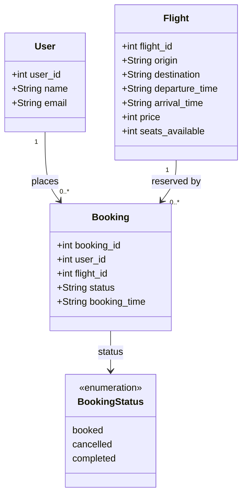

# Data Model — Class Diagram

Visual representation of the SQLAlchemy ORM models defined in
[`booking_system_backend/models.py`](../../booking_system_backend/models.py)
and the `BookingStatus` values inferred from seed data and frontend types.

## Notes

- `BookingStatus` is **not a real enum** in the codebase — `Booking.status` is `Column(String)`. The three values are enforced by convention only; no DB constraint exists.
- No SQLAlchemy `relationship()` is defined on any model. The arrows represent DB-level FK constraints only; joins are performed manually in service code.
- All time fields (`departure_time`, `arrival_time`, `booking_time`) are `Column(String)` — not `DateTime`. Times are stored as ISO 8601 strings.
- `booking_system_inventory_hold_service` does not exist in the repository; no Java domain classes are represented.
