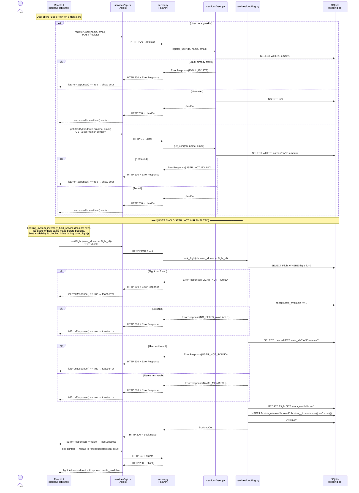

# Booking Flow — Sequence Diagram

End-to-end flow for a user booking a flight, traced across
[`booking_system_frontend/src/services/api.ts`](../../booking_system_frontend/src/services/api.ts),
[`booking_system_backend/server.py`](../../booking_system_backend/server.py),
and [`booking_system_backend/services/booking.py`](../../booking_system_backend/services/booking.py).

## Notes

- All HTTP responses are **status 200**, including errors. The frontend uses `isErrorResponse()` (checks `response.success === false`) to distinguish success from failure.
- There is no quote or hold step. `booking_system_inventory_hold_service` does not exist in the repository.
- Seat decrement and booking insert happen in a single `db.commit()` — there is no two-phase hold. Concurrent requests are not protected by a DB-level lock.
- `booking_time` is stored as a plain string via `datetime.utcnow().isoformat()` — no timezone suffix.
