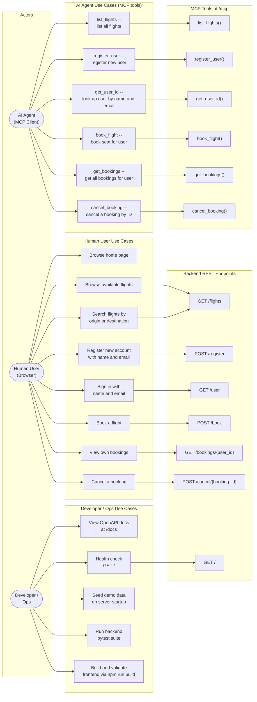

# Actors & Use Cases — Use Case Diagram

All actors and use cases identified from the frontend pages
([`booking_system_frontend/src/App.tsx`](../../booking_system_frontend/src/App.tsx),
[`src/services/api.ts`](../../booking_system_frontend/src/services/api.ts)),
the REST endpoints, and the MCP tools in
[`booking_system_backend/server.py`](../../booking_system_backend/server.py).

## Notes

- **Human User** and **AI Agent** have symmetric capabilities — every action a user can perform via the UI has an equivalent MCP tool, and vice versa.
- **Search** (HU_3) is frontend-only — it filters the already-fetched flight list client-side; no dedicated search endpoint exists on the backend.
- `booking_system_inventory_hold_service` does not exist; no hold or quote actor is represented.
- The `GET /user` endpoint requires **both** name and email — there is no lookup by email alone.
