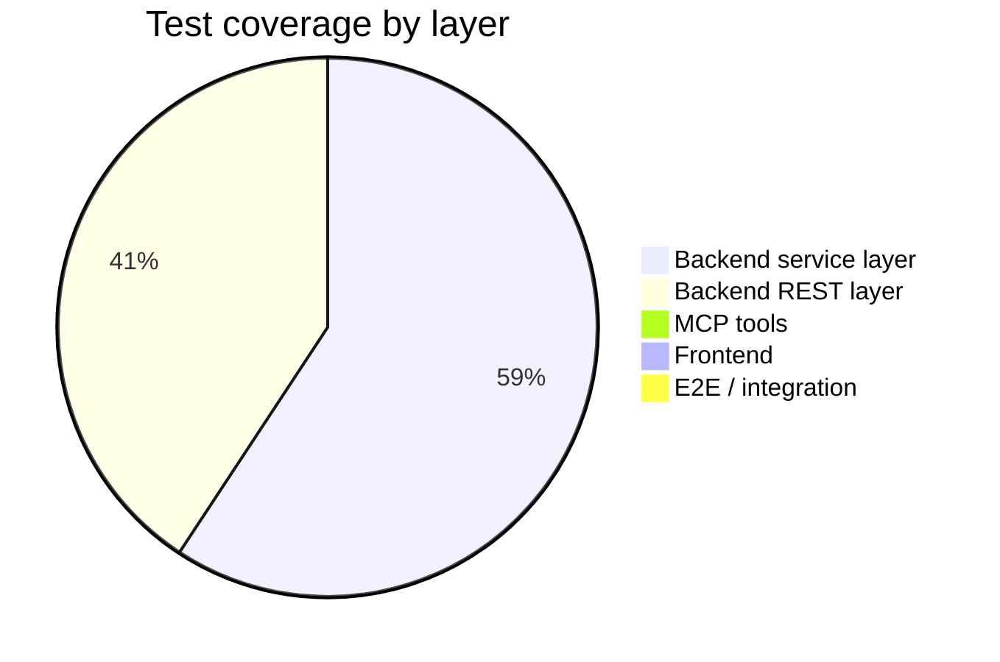

# Galaxium Travels — Test Coverage Analysis

> Ground-truth analysis based on reading every test file in the repository.
> Two of the three referenced services do not exist or have no tests.

---

## Table of Contents

1. [Summary](#1-summary)
2. [booking_system_backend](#2-booking_system_backend)
3. [booking_system_inventory_hold_service](#3-booking_system_inventory_hold_service)
4. [booking_system_frontend](#4-booking_system_frontend)
5. [Gap Analysis & Recommendations](#5-gap-analysis--recommendations)

---

## 1. Summary

| Service | Test Framework | Test Files | Total Tests | Coverage verdict |
|---|---|---|---|---|
| `booking_system_backend` | pytest | 2 | 24 | Partial — service & REST layers only |
| `booking_system_inventory_hold_service` | — | — | — | **Does not exist in repo** |
| `booking_system_frontend` | — | 0 | 0 | **None** |

---

## 2. `booking_system_backend`

### Framework & Configuration

| Item | Detail |
|---|---|
| Framework | pytest + pytest-asyncio + pytest-cov |
| HTTP testing | `httpx` via FastAPI `TestClient` |
| Config | `pytest.ini` — `testpaths = tests`, flags `-v --tb=short` |
| Run from | `booking_system_backend/` directory only |

### Test Structure

```
booking_system_backend/tests/
├── conftest.py        # Fixtures: db_session, client, sample data
├── test_services.py   # 13 tests — pure service function calls, no HTTP
├── test_rest.py       # 11 tests — REST endpoints via TestClient
└── __init__.py
```

### Fixture Strategy (`conftest.py`)

- In-memory SQLite with `StaticPool`; schema created and dropped per test (`scope="function"`)
- `monkeypatch` replaces `SessionLocal` in both `server` and `db` modules
- `seed()` patched to a no-op — every test starts with an empty DB
- `dependency_overrides[get_db]` applied before yield, cleared after
- Shared data fixtures: `sample_user_data`, `sample_flight_data`, `sample_booking_data`

### `test_services.py` — Service Layer (13 tests)

Calls service functions directly with `db_session`. No HTTP involved.

| Class | Test | What is verified |
|---|---|---|
| `TestFlightService` | `test_list_flights_empty` | Returns `[]` on empty DB |
| | `test_list_flights_with_data` | Returns correct `origin` / `destination` |
| `TestUserService` | `test_register_user_success` | `UserOut` returned; `user_id > 0` |
| | `test_register_user_duplicate_email` | `ErrorResponse{EMAIL_EXISTS}` |
| | `test_get_user_success` | Correct `UserOut` on valid lookup |
| | `test_get_user_not_found` | `ErrorResponse{USER_NOT_FOUND}` |
| `TestBookingService` | `test_book_flight_success` | `status == "booked"`; seat decremented from 5 → 4 |
| | `test_book_flight_not_found` | `ErrorResponse{FLIGHT_NOT_FOUND}` |
| | `test_book_flight_no_seats` | `ErrorResponse{NO_SEATS_AVAILABLE}` |
| | `test_book_flight_user_not_found` | `ErrorResponse{USER_NOT_FOUND}` |
| | `test_book_flight_name_mismatch` | `ErrorResponse{NAME_MISMATCH}` |
| | `test_cancel_booking_success` | `status == "cancelled"`; seat restored from 4 → 5 |
| | `test_cancel_booking_not_found` | `ErrorResponse{BOOKING_NOT_FOUND}` |
| | `test_cancel_booking_already_cancelled` | `ErrorResponse{ALREADY_CANCELLED}` |
| | `test_get_bookings_success` | Returns list with correct status |
| | `test_get_bookings_empty` | Returns `[]` for unknown `user_id` |

All 7 defined error codes are exercised at the service layer.

### `test_rest.py` — REST Layer (11 tests)

Calls HTTP endpoints via `TestClient`. All responses assert `status_code == 200` (by design — errors are always HTTP 200). Error detection uses `data["success"] == False`.

| Class | Endpoint | Scenario | Key assertion |
|---|---|---|---|
| `TestFlightsEndpoint` | `GET /flights` | Empty DB | `[]` |
| | | With data | `origin == "Earth"` |
| `TestRegisterEndpoint` | `POST /register` | Success | `user_id` present |
| | | Duplicate email | `error_code == "EMAIL_EXISTS"` |
| `TestUserEndpoint` | `GET /user` | Success | `name` matches |
| | | Not found | `error_code == "USER_NOT_FOUND"` |
| `TestBookEndpoint` | `POST /book` | Success | `status == "booked"` |
| | | Flight not found | `error_code == "FLIGHT_NOT_FOUND"` |
| `TestBookingsEndpoint` | `GET /bookings/{id}` | With bookings | `status == "booked"` |
| | | Empty | `[]` |
| `TestCancelEndpoint` | `POST /cancel/{id}` | Success | `status == "cancelled"` |
| | | Not found | `error_code == "BOOKING_NOT_FOUND"` |
| `TestHealthEndpoint` | `GET /` | Health check | `{"status": "OK"}` |

### Backend Gaps

| Gap | Severity | Detail |
|---|---|---|
| REST `NO_SEATS_AVAILABLE` not covered | Medium | Covered at service layer; REST path untested |
| REST `NAME_MISMATCH` not covered | Medium | Covered at service layer; REST path untested |
| REST `ALREADY_CANCELLED` not covered | Medium | Covered at service layer; REST path untested |
| MCP tools entirely untested | High | All 6 tools (`list_flights`, `book_flight`, `cancel_booking`, `get_bookings`, `register_user`, `get_user_id`) have zero tests |
| Concurrent booking race condition | High | `seats_available` has no DB-level lock; parallel requests can double-book; no test covers this |
| No coverage threshold enforced | Low | `pytest-cov` installed but `--cov` not in `pytest.ini`; no `fail_under` set |
| `requirements.txt` unpinned | Low | Floating deps make CI results non-reproducible |

---

## 3. `booking_system_inventory_hold_service`

**This service does not exist in the repository.**

A full recursive search found no directory, file, Dockerfile, or configuration at or under `booking_system_inventory_hold_service/`. It cannot be analysed. If it is planned, no tests can be evaluated until the service is created.

---

## 4. `booking_system_frontend`

**No tests of any kind exist.**

A full search of `booking_system_frontend/src/` confirmed:

- No `.test.ts`, `.test.tsx`, `.spec.ts`, `.spec.tsx` files
- No `__tests__/` directories
- No `jest.config.*`, `vitest.config.*`, or `playwright.config.*`
- No test-related scripts in `package.json`

The only validation gate is:

```bash
cd booking_system_frontend
npm run build    # tsc -b && vite build
```

This catches type errors and broken imports — nothing about runtime behaviour.

### Untested Frontend Logic

| File | Critical untested logic |
|---|---|
| `services/api.ts` | `isErrorResponse()` predicate; Axios response interceptor error normalisation; all 6 API functions |
| `hooks/useUser.tsx` | Session state set/clear; `logout()` behaviour |
| `pages/Flights.tsx` | Search filter (origin/destination substring match); unauthenticated booking redirect flow |
| `pages/MyBookings.tsx` | `getFlightForBooking()` client-side join; cancel modal open/close/confirm state machine; redirect when no user |
| `utils/formatters.ts` | All formatter functions |
| `components/bookings/BookingModal.tsx` | Booking submission; error display; loading state |
| `components/user/UserIdentification.tsx` | Register vs sign-in branch; error display |

---

## 5. Gap Analysis & Recommendations

### Coverage at a Glance



### Priority Matrix

| Priority | Action | Location |
|---|---|---|
| 🔴 High | Add MCP tool tests using an in-process MCP client against the same `db_session` fixture | `tests/test_mcp.py` |
| 🔴 High | Add E2E tests for the booking lifecycle: register → browse → book → cancel | Playwright in `booking_system_frontend/` |
| 🟡 Medium | Add missing REST error-path tests: `NO_SEATS_AVAILABLE`, `NAME_MISMATCH`, `ALREADY_CANCELLED` | `tests/test_rest.py` |
| 🟡 Medium | Add Vitest unit tests for `isErrorResponse()`, Axios interceptor, and all `api.ts` functions | `booking_system_frontend/src/services/api.test.ts` |
| 🟡 Medium | Add concurrent booking test to verify seat count under parallel requests | `tests/test_services.py` |
| 🟢 Low | Enforce coverage threshold: add `--cov=. --cov-fail-under=80` to `pytest.ini` | `pytest.ini` |
| 🟢 Low | Pin `requirements.txt` to exact versions | `requirements.txt` |

### Running the Backend Tests

```bash
cd booking_system_backend
.venv\Scripts\activate             # Windows
source .venv/bin/activate          # Unix

pytest                              # all 24 tests
pytest tests/test_services.py      # service layer only
pytest tests/test_rest.py          # REST layer only
pytest -k "test_book_flight"       # match by name pattern
pytest tests/test_rest.py -k "test_get_flights_empty"   # single test
pytest --cov=. --cov-report=term-missing                # with coverage
```
